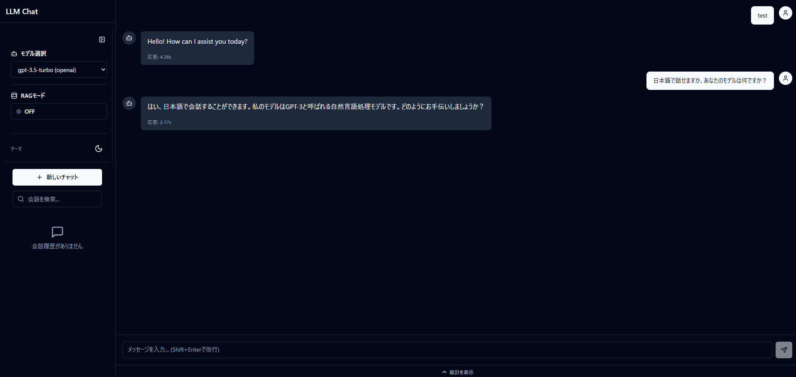

# AI Development Portfolio

AI技術の実践的な学習と開発スキルの体系化を目的としたポートフォリオリポジトリ

## このリポジトリについて

現在、社内SEとして就業しながら、モダン開発スキルを活かして**AI領域のソフトウェア開発者**へのキャリア転換を目指しています。本リポジトリは、LLMアプリケーション開発からMLOps/AIインフラまでを段階的に学習・実装し、その過程と成果物を公開するものです。

## 学習ロードマップ

```
Phase 1          Phase 2              Phase 3              Phase 4
LLM基礎    →    Web UI + RAG    →    AIエージェント   →    MLOps/LLMOps/AIインフラ
━━━━━━━━━━━━━━━━━━━━━━━━━━━━━━━━━━━━━━━━━━━━━━━━━━━━━━━━━━━━━━━━━━━━
✅ 完了          ✅ 完了               📋 計画中             📋 計画中
```

| Phase | テーマ | 内容 | 状態 |
|-------|--------|------|------|
| 1 | LLM Chat App (CLI) | 商用API + ローカルモデルによるチャットアプリ | ✅ 完了 |
| 2 | Web UI + RAG | FastAPI + Next.js ダッシュボード、ドキュメント検索拡張 | ✅ 完了 |
| 3 | AIエージェント | 情報収集・タスク自動化エージェントの構築 | 📋 計画中 |
| 4 | MLOps / LLMOps / AIインフラ | モデルデプロイ、ファインチューニング、推論最適化、LLMOps、Vision | 📋 計画中 |

---

## Phase 1: LLM Chat App (CLI版) ✅

> **タグ**: `v1.0-cli-complete`

商用LLM APIとローカルモデルの2つのアプローチでチャットアプリを実装し、LLM技術の基礎を習得。

### 主な実装内容

- OpenAI / Claude / Gemini の3プロバイダー対応
- llama-cpp-python によるローカルLLM実行
- リアルタイムストリーミング表示
- 会話履歴管理（メモリ + JSON永続化）
- YAML設定管理、ログ機能、パフォーマンス統計

### 学んだこと

- LLM APIの共通インターフェース設計（ストラテジーパターン）
- ストリーミングレスポンスの処理パターン
- トークン制限を考慮した会話履歴管理
- プロパティベーステスト（Hypothesis）によるコード品質担保

📁 詳細: [`llm_chat_app/README.md`](llm_chat_app/README.md)

---

## Phase 2: Web UI + RAG ダッシュボード ✅

> **タグ**: `v2.0-web-ui-rag`

既存CLI版を拡張し、プロフェッショナルなダッシュボード型Web UIとRAG機能を追加。

### 主な実装内容

- **FastAPI バックエンド**: SSEストリーミング、モデル管理API、統計API
- **Next.js フロントエンド**: shadcn/ui ダッシュボード、リアルタイムチャットUI
- **RAG エンジン**: PDF/テキスト/Markdownのドキュメント検索拡張
- **統計ダッシュボード**: トークン使用量、コスト可視化

### 技術スタック

| レイヤー | 技術 |
|---------|------|
| バックエンド | Python, FastAPI, sse-starlette, LangChain |
| フロントエンド | Next.js 14 (App Router), TypeScript, Tailwind CSS, shadcn/ui |
| RAG | ChromaDB, sentence-transformers |
| グラフ | recharts |

### セットアップ手順

```bash
# 1. バックエンド起動
python -m venv .venv
.venv\Scripts\activate
pip install -r backend/requirements.txt

# 環境変数を設定（APIキー等）
set OPENAI_API_KEY=your-api-key

# サーバー起動
uvicorn backend.app.main:app --reload --port 8000

# 2. フロントエンド起動（別ターミナル）
cd frontend
npm install
echo NEXT_PUBLIC_API_URL=http://localhost:8000 > .env.local
npm run dev
```

### 使用方法

1. **チャット**: メイン画面でメッセージを入力し、SSEストリーミングでリアルタイム応答を確認
2. **モデル切り替え**: サイドバーのドロップダウンからOpenAI / Claude / Geminiを選択
3. **RAGモード**: サイドバーでRAGトグルをONにし、ドキュメントをアップロード。チャット時にドキュメント内容を参照した回答を生成
4. **統計確認**: 統計パネルでトークン使用量、コスト、時系列グラフを確認
5. **会話履歴**: 履歴パネルからセッションを選択して再開、キーワード検索で過去の会話を検索

### 画面構成

| エリア | 説明 |
|--------|------|
| サイドバー | モデル選択、RAGトグル、ドキュメント一覧、会話履歴 |
| メインチャット | SSEストリーミングチャット（Markdownレンダリング対応） |
| 統計パネル | 累積統計カード、モデル使用比率チャート、時系列グラフ |

### スクリーンショット



📁 バックエンド詳細: [`backend/README.md`](backend/README.md)
📁 フロントエンド詳細: [`frontend/README.md`](frontend/README.md)

---

## Phase 3: AIエージェント 📋

タスク自動化や情報収集を行うAIエージェントの構築を予定。

### 想定する内容

- LLMを活用したツール呼び出し（Function Calling）
- 情報収集エージェント（Web検索 + 要約）
- タスク自動化（マルチステップ推論）
- Phase 2のバックエンドを拡張する形で実装

---

## Phase 4: MLOps / LLMOps / AIインフラ 📋

AI/MLの本格的な運用基盤とモデル開発の深い領域に踏み込む予定。

### 想定する内容

- モデルサービング・デプロイパイプライン
- ファインチューニング（LoRA / QLoRA）
- 推論最適化（量子化、バッチ推論）
- Vision系モデルの活用
- Docker / コンテナ化されたML環境
- **LLMOps**: プロンプト管理、RAGパイプライン監視、コスト最適化（モデルルーティング）、評価基盤（LLM-as-Judge）、セーフティガードレール

---

## プロジェクト構造

```
AI_dev/
├── llm_chat_app/        # Phase 1: CLI版チャットアプリ
├── backend/             # Phase 2: FastAPIバックエンド（開発中）
├── frontend/            # Phase 2: Next.jsフロントエンド（開発中）
├── docs/                # ドキュメント
├── tests/               # テスト
└── .kiro/specs/         # 仕様書（要件定義・設計・タスク）
```

## 開発環境

- **OS**: Windows
- **Python**: 3.9+（CIでは3.9/3.11でテスト）
- **Node.js**: 18+ (フロントエンド)
- **エディタ**: VS Code + Kiro
- **バージョン管理**: Git / GitHub
- **CI/CD**: GitHub Actions（pytest, mypy, black, flake8, isort）

## セットアップ

```bash
# クローン
git clone https://github.com/vellkoma/AI_dev.git
cd AI_dev

# Python仮想環境
python -m venv .venv
.venv\Scripts\activate

# Phase 1 (CLI版 - APIモード)
pip install -r requirements.txt
copy config.yaml.example config.yaml
python -m llm_chat_app.main --mode api

# Phase 1 (CLI版 - ローカルモデル)
python -m llm_chat_app.main --mode local --provider ollama
# ※ Ollamaの事前インストールとモデルのpullが必要
# 詳細: docs/LOCAL_MODEL_SETUP.md

# Phase 2 (Web UI + RAG)
pip install -r backend/requirements.txt
uvicorn backend.app.main:app --reload --port 8000

# フロントエンド（別ターミナル）
cd frontend
npm install
npm run dev
```

詳細は各フェーズのREADMEを参照してください。

## ライセンス

MIT License
